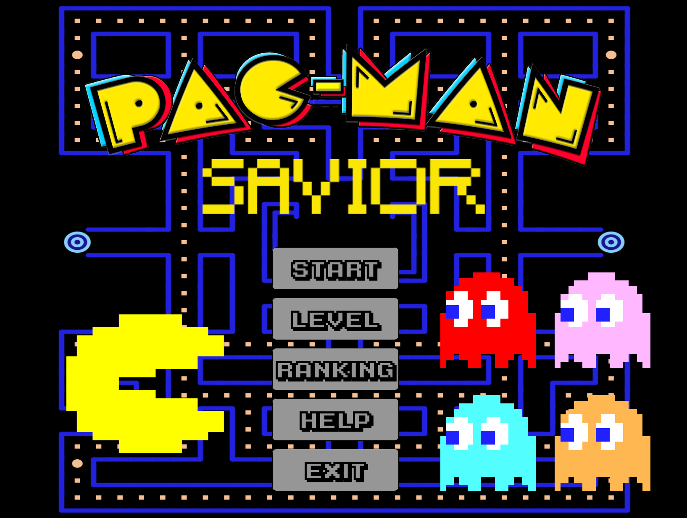
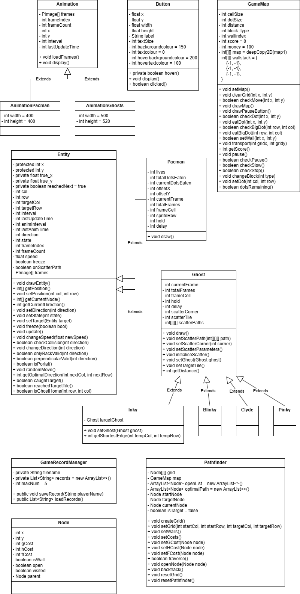
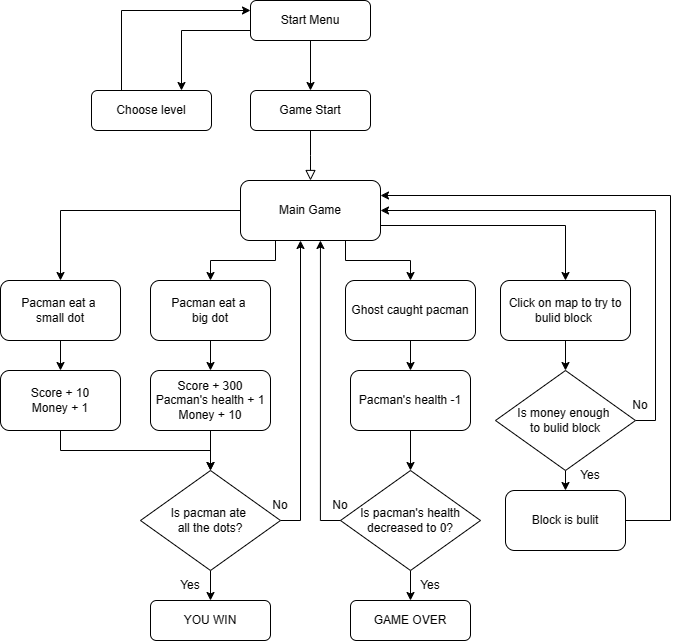
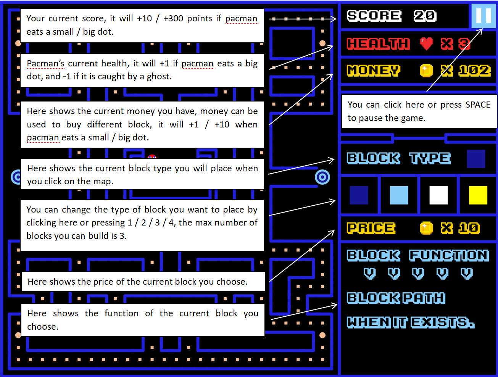
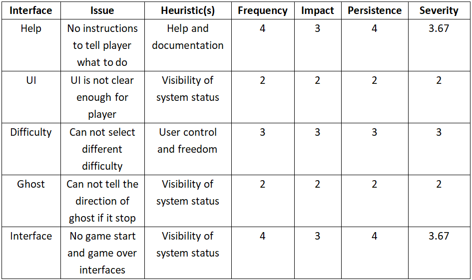

## Game Video Link: https://youtu.be/6X-PJXRcBWU

## PART 1: TEAM 
### 2024-group-4

   

Juean Chen   ad23091@bristol.ac.uk   ad23091

Xiaokang Fan   dr23824@bristol.ac.uk   SeventyThree73

Nicky Dickson   kr23498@bristol.ac.uk   nd1221

---

## PART 2: INTRODUCTION

### Game Name: Pac-Man Savior 

   

_Sprite credit: The Pixel Master_

### Game Introduction

Our game is a redesign of the classic Pac-Man created by Namco in 1980 featuring an added twist. Just as in the original, the goal remains for Pacman to travel across the game map, eating pellets and avoiding ghosts. However, in the original, the player has direct control of pacman and is free to decide where and how Pacman should move. In our version, the player has no control whatsoever, they are only allowed to manipulate the map itself by strategically placing blocks to block certain paths Pacman or the ghosts may take acting as a saviour-slash-personal-assistant to Pacman. Both the ghosts' and Pacman's movements are AI controlled and the player's job is to guide Pacman towards his goal of eating all pellets in the map whilst making sure the ghosts stay clear. With every pellet eaten, the player receives a payment which can be spent to purchase extra blocks or blocks with special abilities.

 

---

### Ideation:

To begin with, we decided to come up with two ideas individually then meet in person to present them to each other and pick two from the pool of six to explore further. After a quick vote, we settled on a Vampire-Survivor-style game and a Pacman-style game (which was presented twice). To determine which idea we should pursue further, we conducted requirements engineering practices for both games: identifying stakeholders, specifying system behaviour through use case diagrams and specifications, and creating paper prototypes for boths games.

### Other Game Ideas

**1. Vampire Survivors**
   
_Description:_
An action roguelike game where players need to survive while encountering an evolving horde of monsters in a limited time. Eliminating monsters provides experience for players to level up which presents the player with several choices, such as upgrading their weapon, buying a new weapon or adding player buffs. Before the game starts, the player chooses their weapon and one of 3 difficulty modes: easy, middle, hard.
   
_Challenges:_
- How to create an evolving horde of monsters?
- How to design different weapons?
- How to balance the game difficulty and the fun of playing the game?
 

**2. Defend Zombies**

_Description:_
Players assume the role of a gardener using a variety of plants to protect their home from an ever-evolving zombie horde. During the day the player must prepare their home for assault by deploying plants, upgrading strategic defences, and using special props to defend against zombies. At night, waves of zombies descend on the player's house intending to cause havoc. As players progress, they can unlock more plant species and upgrades to face greater challenges.

_Challenges:_
- How to design unique zombies?
- How to design different defence towers?
- How to balance game difficulty and fun of playing the game?
 

**3. Grand Strategy Chess**

_Description:_
In Grand Strategy Chess, players will play the role of generals from different historical periods and command their armies to fight on a map composed of checkerboards. Each checkerboard represents a different terrain, such as plains, mountains, forests, and rivers, and each terrain will have an impact on the outcome of the battle. Players need to use strategic deployment, troop matching and terrain utilization to defeat their opponents and win.

_Core gameplay:_
Strategic deployment: Before battle, players need to deploy their own troops according to the opponent's arms and the map's terrain, and arrange infantry, cavalry, archer and special unit positions.
Combination of arms: Different arms have their own advantages and disadvantages on different terrains. Players must choose the most appropriate combination of arms based on the battlefield environment and the opponent's strategy.
Terrain utilization: Use the advantages of the terrain to deploy defense or attack.
Tactical change: Players can adjust tactics according to changes during battle, such as switching from defense to offense, or using special units to conduct surprise attacks.

_Challenges:_
- Balance: Ensuring all classes, special units, and terrain effects are balanced in the game, whether in single-player campaigns or multiplayer battles.
- Strategic Depth: Designing mechanics and tactical possibilities that are complex enough to satisfy players of all skill levels while keeping the game accessible.
- Map diversity: Create rich and diverse maps and campaign stories to increase the replay value of your game.
 

**4. Maze Tank Blitz**

_Description:_
In Maze Tank Blitz, players drive tanks to fight in a maze full of obstacles and traps. The goal of the game is to use your tank's cannon and special abilities to defeat your enemies while avoiding the maze's traps and enemy attacks. The game offers multiple different maze maps, each with unique designs and challenges. Players can fight alone or with friends in split-screen or online multiplayer modes.

_Core gameplay:_
Maze exploration: Players need to find the best path in a complex maze to attack enemies while avoiding being discovered and attacked by enemies.
Combat and Strategy: Players must take advantage of the maze's environment to defeat their opponents through strategic deployment and quick reactions.
Upgrades and Customization: After defeating enemies, players can collect resources to upgrade their tanks, including increased firepower, defense, and speed.

_Challenges:_
- Balance: Ensuring balance between all weapons to make the game both fair and challenging.
- Maze generation algorithm: Designing an algorithm to generate fair and interesting maze layouts and provide a diverse gaming experience.
- Special abilities: Implemeting a range of special items and distributing them fairly throughout the map.

 

---

## PART 3: REQUIREMENTS

### Stakeholder Identification

We identified the following stakeholders:

* Developers
* Project manager
* Players
* Project markers

 

### User Stories

>"As a developer, I want to make a game that is popular, so that I achieve more exposure and build a reputation."
>
>"As the project manager, I want to ensure the game developed is meets all requirements on time and on budget, so that financial stakeholders are satisfied."
>
>"As a player, I want to be able to select different levels of varying difficulties so that I can choose how intense my game will be based on my own experience."
>
>"As a player, I want to see how many lives my character has, so that I can adjust my in-game strategy and resource management to stay alive as long as possible."
>
>"As a player, I want to have be able to see tutorial examples so I can prepare a gameplay strategy."
>
>"As a marker for this project, I want to see groups create engaging and well made games, with a good twist and a strong development process that utilises the techniques taught in this module."

 

### Use-case specifications

_Easy Mode:_
Ghosts move randomly

_Hard Mode:_
Ghosts chase player

 

| Use-Case Section | Easy Mode | Hard Mode |
|-|-|-|
| **Description** | A run through of a level where ghosts' movement logic is random | A run through of a level where the ghosts' movement logic is determined by a pathfinding algorithm and ghosts will target the player |
| **Basic Flow**  | Consume all pellets in the level without dying | Consume all pellets in the level without dying |
| 1. | User places blocks on map to guide Pacman along a path of their choosing while avoiding collisions with ghosts | User places blocks on map to guide Pacman along a path of their choosing. Ghosts target Pacman, so user must devote more game resources to blocking the paths of incoming ghosts. |
| 2. | Pacman earns money by eating pellets, which the user can spend at the block shop to purchase more powerful blocks | User focuses on collecting pellets to purchase blocks which can slow or freeze ghosts' movements to more easily achieve the objective |
| 3. | User guides Pacman to consume all pellets on the map without being caught by a ghost | User guides Pacman to consume all pellets on the map without being caught by a ghost |
| **Alternative Flow** | Collision with ghost leads to Pacman losing a life and being respawned | Ghost chases and catches Pacman before user has time to block it's path or purchase a 'special' block |
| 1 | User guides Pacman around the map to collect pellets by placing blocks to block certain paths | User guides Pacman around map. Each new ghost released will use a pathfinding algorithm to dynamically target Pacman |
| 2 | User does not manage to place a block in time to stop Pacman from colliding with ghost or ghost makes an unexpected turn into Pacman's path | User navigates alternate waves of ghost attacks. Ghosts will periodically move towards the four corners of the map, and then will converge in on Pacman, finding the nearest alternative route if the user blocks their path. |
| 3 | Collision between Pacman and ghost reduces Pacman's lives by one and returns pacman to his spawn point. Repeat steps 1 and 2. | One or multiple ghosts converge in on Pacman and the user does not have enough blocks to prevent themselves being caught, resulting in the loss of a life and being respawned. Repeat steps 1 and 2. |
| 4 | If Pacman's lives are reduced to zero, the game ends. The user is prompted to input their name and their score is recorded. | If Pacman's lives are reduced to zero, the game ends. The user is prompted to input their name and their score is recorded. |

 

### Use-case diagram

To ensure the entire team was was on the same page regarding system-user interactions and the functional requirements of the game, we made use of several UML techniques. The use-case diagram was intended to act as a quick reference to show what our desired system behaviour is and how the different (planned) components should eventually interact with each other.  

   

 

### Class Diagram

The class diagram was initially created as a general blueprint for the game's structure which we would follow to maximise programming cohesion. As our ideas developed and the features we implemented increased, we gradually updated the class diagram and found it to be a useful visual aid throughout the development process, particularly as complexity grew. However, due to the speed of feature increments, the class diagram became a 'documentation' tool as opposed to a planning tool as we predominantly referred back to it during team meetings when presenting what changes we had made to the system. Although, it did aid in the development process as we were able to easily spot a few circular design malpractices and refactor them.

   

 

### Behavioural Diagram

As the complexity of the class diagram grew, it became increasingly difficult to decipher at a glance. We decided it would be beneficial to create a behavioural diagram to show the intended program flows.

   

 

---

## PART 4: DESIGN

### System Architecture Overview

* Start Menu
   * START: start the main game.
   * LEVEL: choose the difficulty of the game, 5 levels in total, higher levels equates to higher difficulty and a higher score multiplier.
   * RANKING: show the 5 top scoring players in the ranking list.
   * HELP: show the functionality of the user interface in the main game.
   * EXIT：exit the game.
 
* Main Game
  * Player places blocks to stop ghosts from catching Pacman and ensuring Pacman consumes all pellets.

   

* End Scene
   * YOU WIN: if all pellets are consumed, the player wins and is asked to enter their name and score.
   * GAME OVER: if Pacman's health is decreased to 0, the game is over and the player is asked to enter their name and score.

 

---

## PART 5: IMPLEMENTATION

We identified a series of challenges in making such a game. These included how to design and program different kinds of blocks, how to design the AI for the character and the ghosts and how to balance the game difficulty.

### Challenges

**1. Pacman and ghosts' movement logic, design and implementation:**

This proved to be the most programmingly complex of our three challenges because it entailed creating a tilemap to overlay the game map, a collision detection system which restricted sprites to orthogonal paths within the tilemap and implementing pathfinding algorithms to guide moveable entities. Despite this, the implementation did not end up being as difficult as we had thought.

We decided to use the A* algorithm to determine the ghosts' movement and return the shortest path between a given ghost and Pacman. A* was chosen due to its completeness, efficiency and optimality - guaranteeing it would return the best possible path. We also implemented the breath first search algorithm and incorporated it into Pacman's late-game movement logic to allow him to move to the nearest unknown pellet (which precluded reusing A*). These were packaged in the Pathfinder class.

The difficulty regarding this challenge came in interfacing the tilemap with the game map. The tilemap is comprised of nodes, each holding the relevant information needed to calculate the above algorithms (fCost, hCost, etc.), so the Pathfinder class returned the the optimal path to a target _tile_ on the tilemap rather than a target position on the game map itself. Given that entities were restricted to orthogonal movements, we could not just send a sprite to its target by altering its x and y coordinates without breaking the collision detection system. The solution we found was to calculate the position of the next tile in the optimal path relative to a moveable entity's current tile and use it to set that entity's movement direction and repeat until the entity had collided with its target.

 

**2. Interaction between blocks and moveable entities:**

Handling interactions between dynamically placed blocks and moving entities was slightly harder than anticipated but overall not too challenging. Implementing blocks' functionality was straightforward but the bugs introduced to the rest of the game were not. Blocks which altered the speed of game entities revealed an oversight in the collision detection system which was solved by altering when speed changes were made. Collisions were only checked for when sprites were exactly overlaid on their current tile, so changing the speed before this happened sent sprites flying off the screen.

 

**3. How to balance game difficulty and pace:**

This challenge was by far the hardest and the one which consumed the biggest chunk of development and testing time. While challenge 2 required a few bug fixes for the collision detection system, issues regarding balancing game difficulty and pace led us to completely overhaul collisions. Our previous collision detections only allowed a sprite's speed to be a factor of the cell size (40 pixels), otherwise it would fly off screen. We persisted with this method as it allowed speeds of 2, 4, and 5 pixels per game loop and was computationally efficient. However, after playtesting, it became clear that an initial speed of 2 was frustratingly slow and a redesign was needed. Our final collision detection system checks for a collison on every game loop instead allowing for a sweet-spot initial speed of 3.

Issues regarding Pacman's movement logic further plagued us. To begin with, we intended for Pacman's movements to be driven by a breath first search algorithm to always guide him to the nearest pellet so the player could solely focus on repelling ghosts. After a few playtesting sessions, we realised this presented no real challenge so decided to gradually improve his movement logic depending on how many ghosts are currently released in the map. After many iterations, we found the most optimal solution was to let Pacman move randomly until the third ghost is released. At this point, Pacman stops making unexpected (and often frustrating) direction changes when there are pellets in front of him and will travel to a random pellet on the map if none are within range. After four ghosts are released and the game speed is increased, Pacman will then switch to using BFS to optimally travel to the remaining pellets while the player focuses on blocking ghosts. This solution allows for a much smoother build up of difficulty within the level, better retaining a player's attention.

Finally, we noticed that the block pricing system was unbalanced: blocks, specifically those with special abilities, were too cheap and effectively erased the game's challenges. A player could purchase a freeze block early and leave it on the map for the rest of the game, collecting pellets while ghosts cannot move. To solve these problems, we increased the prices of blocks such that the player is forced to spend on basic blocks in the early game and make freezing or slowing ghosts a late game strategy.

 

---

## PART 6: EVALUATION

### Qualitative Evaluation

* In this part, we have a set of 5 people to do the qualitative evaluation in order to produce some advice for the game development.

**Heuristic Evaluation**
* Project Title: Pacman Savior

* Suggestions from players:
1. Add more interface/UI for the game to improve the HCI experience.
2. Add more instructions for the game to guide the players.
3. Add more difficulties to the game to add different experience.

 

### Quantitative Evaluation

* In this part, we have a set of 10 people to do the quatitative evaluation in order to produce some evluation for the different game difficulties.

### - GAME EASY LEVEL -

**NASA TLX**

| Player No | Mental demand | Physical demand | Temporal demand | Performance | Effort | Frustration | Raw score |
| ------- | ------- | ------- | ------- | ------- | ------- | ------- | ------- |
| 1 | 15 | 10 | 15 | 20 | 30 | 10 | 17 |
| 2 | 20 | 20 | 30 | 35 | 30 | 20 | 26 |
| 3 | 15 | 15 | 40 | 30 | 20 | 25 | 24 |
| 4 | 30 | 10 | 30 | 35 | 20 | 15 | 23 |
| 5 | 15 | 15 | 35 | 40 | 35 | 30 | 28 |
| 6 | 20 | 10 | 30 | 20 | 30 | 20 | 22 |
| 7 | 30 | 15 | 30 | 25 | 20 | 15 | 23 |
| 8 | 20 | 10 | 25 | 45 | 25 | 20 | 24 |
| 9 | 15 | 20 | 30 | 25 | 25 | 15 | 21 |
| 10 | 20 | 15 | 20 | 20 | 35 | 10 | 20 |

**System Usability Scale**

| Question No \ Player No | 1 | 2 | 3 | 4 | 5 | 6 | 7 | 8 | 9 | 10 | 
| --------------- | ----- | ----- | ----- | ----- | ----- | ----- | ----- | ----- | ----- | ----- | 
| 1. I think that I would like to use this system frequently. | 4 | 5 | 4 | 3 | 4 | 3 | 5 | 4 | 4 | 5 |
| 2. I found the system unnecessarily complex. | 2 | 1 | 2 | 3 | 2 | 1 | 2 | 1 | 3 | 2 |
| 3. I thought the system was easy to use. | 4 | 4 | 5 | 4 | 3 | 4 | 4 | 5 | 4 | 5 |
| 4. I think that I would need the support of a technical person to be able to use this system. | 1 | 1 | 2 | 2 | 1 | 1 | 2 | 1 | 1 | 2 |
| 5. I found the various functions in this system were well integrated. | 5 | 5 | 4 | 4 | 5 | 4 | 4 | 5 | 4 | 4 |
| 6. I thought there was too much inconsistency in this system. | 2 | 2 | 3 | 1 | 2 | 1 | 2 | 1 | 1 | 2 |
| 7. I would imagine that most people would learn to use this system very quickly. | 4 | 4 | 5 | 3 | 5 | 4 | 4 | 3 | 5 | 4 |
| 8. I found the system very cumbersome to use. | 2 | 3 | 2 | 2 | 1 | 2 | 1 | 2 | 2 | 1 |
| 9. I felt very confident using the system. | 5 | 5 | 4 | 4 | 4 | 4 | 5 | 5 | 4 | 5 |
| 10. I needed to learn a lot of things before I could get going with this system. | 1 | 1 | 2 | 2 | 3 | 2 | 2 | 2 | 1 | 1 |
| System Usability Survey Score | 85 | 87.5 | 77.5 | 70 | 80 | 80 | 82.5 | 90 | 82.5 | 87.5 |

### - GAME HARD LEVEL -

**NASA TLX**

| Player No | Mental demand | Physical demand | Temporal demand | Performance | Effort | Frustration | Raw score |
| ------- | ------- | ------- | ------- | ------- | ------- | ------- | ------- |
| 1 | 20 | 15 | 20 | 25 | 35 | 15 | 22 |
| 2 | 25 | 25 | 35 | 40 | 35 | 25 | 31 |
| 3 | 25 | 25 | 40 | 30 | 30 | 25 | 29 |
| 4 | 30 | 20 | 30 | 35 | 30 | 25 | 28 |
| 5 | 25 | 25 | 35 | 40 | 45 | 30 | 33 |
| 6 | 30 | 20 | 30 | 20 | 30 | 30 | 27 |
| 7 | 30 | 25 | 30 | 35 | 20 | 25 | 28 |
| 8 | 30 | 20 | 25 | 45 | 25 | 30 | 29 |
| 9 | 25 | 20 | 30 | 35 | 25 | 25 | 26 |
| 10 | 20 | 25 | 20 | 30 | 35 | 20 | 25 |

 

**System Usability Scale**

| Question No \ Player No | 1 | 2 | 3 | 4 | 5 | 6 | 7 | 8 | 9 | 10 | 
| --------------- | ----- | ----- | ----- | ----- | ----- | ----- | ----- | ----- | ----- | ----- | 
| 1. I think that I would like to use this system frequently. | 4 | 5 | 4 | 3 | 4 | 3 | 5 | 4 | 4 | 5 |
| 2. I found the system unnecessarily complex. | 2 | 1 | 2 | 3 | 2 | 1 | 2 | 1 | 3 | 2 |
| 3. I thought the system was easy to use. | 4 | 4 | 5 | 4 | 3 | 4 | 4 | 5 | 4 | 5 |
| 4. I think that I would need the support of a technical person to be able to use this system. | 1 | 1 | 2 | 2 | 1 | 1 | 2 | 1 | 1 | 2 |
| 5. I found the various functions in this system were well integrated. | 5 | 5 | 4 | 4 | 5 | 4 | 4 | 5 | 4 | 4 |
| 6. I thought there was too much inconsistency in this system. | 2 | 2 | 3 | 1 | 2 | 1 | 2 | 1 | 1 | 2 |
| 7. I would imagine that most people would learn to use this system very quickly. | 4 | 4 | 5 | 3 | 5 | 4 | 4 | 3 | 5 | 4 |
| 8. I found the system very cumbersome to use. | 2 | 3 | 2 | 2 | 1 | 2 | 1 | 2 | 2 | 1 |
| 9. I felt very confident using the system. | 5 | 5 | 4 | 4 | 4 | 4 | 5 | 5 | 4 | 5 |
| 10. I needed to learn a lot of things before I could get going with this system. | 1 | 1 | 2 | 2 | 3 | 2 | 2 | 2 | 1 | 1 |
| System Usability Survey Score | 85 | 87.5 | 77.5 | 70 | 80 | 80 | 82.5 | 90 | 82.5 | 87.5 |

 

### How code was tested

For user testing, we have used the Heuristic Evaluation, NASA TLX and System Usability Survey (SUS) methods. 

In the Heuristic Evaluation, we let five players explore the interface and content of the game without any guidance from the us and asked them for some advice about the UI and the experience of the game after the exploration process. Based on the result of Heuristic Evaluation, we found that some of the players didn't know the main gameplay of our game due to the lack of enough guidence, they thought that the main gameplay was still control Pac-Man to eat dots instead of placing different kinds of blocks to keep Pac-Man alive and help it eat more dots. We quantified and analysed the results of the survey and added more guidence and improved the UI to make the game better and improve the HCI experience.

In the NASA TLX and System Usability Survey (SUS), we let ten players to play two different levels of the game which are level 2 and level 4 and asked them to fill in the table of NASA TLX and System Usability Survey (SUS) after they played each level. Based on the result of NASA TLX and System Usability Survey (SUS), we found that the difference between different level is small, which indicated us the difficulty of the higher levels might not be enough. After the survey, we quantified and analysed the results of the NASA TLX and System Usability Survey (SUS) and make higher levels of the game more difficult by increasing the speed of the ghosts and making the ghosts to be released earlier to distinguish different difficulties.

 

---

## PART 7: PROCESS

Throughout the project, our team maintained constant communication through WhatsApp and met regularly following the Software Engineering workshop to discuss the current state of the project. We used Skype to have online meetings and GitHub to keep a track of our changes. During in-person meetings, we would identify the most important features that needed to be added by the next meeting and divided these features between ourselves. Upon encountering a bug during development, we would discuss it together through WhatsApp in case someone else could think of a quick solution, otherwise we would meet on Skype to share our screens for more transparent communication and sometimes to pair-program a solution. Following two other members dropping out, we made an effort to keep each other aware of any changes or additions to the game to ensure everyone had a good working knowledge of the codebase and addressed questions about changes made during our in-person meetings. This proved very valuable as it allowed us to write code which more easily integrated into the existing codebase and made git conflicts rare. We will continue to practice this in future projects.

* Here are our roles in this game project:

 

| Juean Chen                                | Xiaokang Fan                         | Nicky Dickson                        |
|-------------------------------------------|--------------------------------------|--------------------------------------|
| UI design & implementation                | Game framework construction          | Implemented pathfinder class to handle Ghost behaviour|
| Maps design & implementation              | Game engineering framework design    | Implemented Entity class to handle collisions|
| Block design & implementation             | Implement most page designs          | Extended Ghost and Pacman classes to inherit from Entity class|
| Original pacman movement logic design     | Implement the button class to simplify button implementation | Optimised Pacman movement behaviour and logic|
| Fix some bugs                             | Implement animation class            | Edited Report                        |
| Write most of the report                  | Optimize entity classes, extend movement methods and give physical meaning ||
| Add sound effect                          | Simplify ghost drawing logic         |                                      |
|                                           | Design game record manager class     |                                      |
|                                           | Fix some bugs                        |                                      |
|                                           | Algorithm optimization               |                                      |

 

---

## PART 8: CONCLUSION

This game development process has taught us a lot about the application of different development tools and techniques. We gained valuable insight into planning and executing a complex project using an agile ethos and an appreciation of the benefits stemming from repeated agile iterations. With regular playtesting and being in constant communication during development, we were able to identify and fix bugs quickly. The regular team meetings coupled with consistent project updates allowed us to be flexible in development and enabled us to temporarily assume others' roles if they were unavailable without any significant issues. Moving forward, we would benefit most by more carefully considering use cases and user stories during the ideation and requirements phase. Many of our issues regarding balancing the difficulty ultimately stemmed from a less than thorough analysis of the project's various flows and end states.

If we had time and resources (and maybe an extra team member) to develop the game further, we would implement some features that are already coded into the game, but we didn't have time to fully integrate. These include extra ghosts (namely Sue, Funky and Spunky) and extra game states such as the frightened ghost state. The current Pathfinder and Animation classes should make their integration relatively easy. The original inspiration for the game was to take a classic game and give the player a role they would not normally play, in this case the player is playing as the game level itself. So additional development could include the addition of power ups that the player must guide Pacman towards and ghosts away from, or the addition of items which damage/alter the level, such as bombs to destroy walls or create holes in the floor that must be avoided.

 

---

## INDIVIDUAL CONTRIBUTION

* Juean Chen: 1.00
* Xiaokang Fan: 1.00
* Nicky Dickson: 1.00

